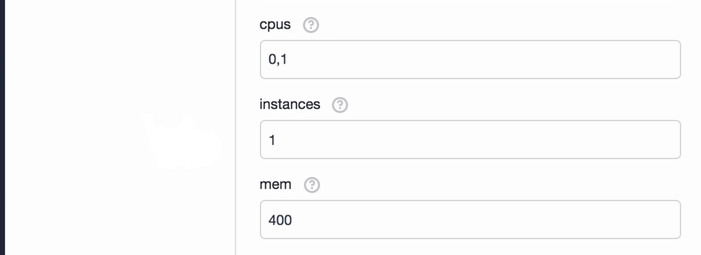

<properties
   pageTitle="Monitor an Azure Container Service cluster with Dynatrace | Microsoft Azure"
   description="Monitor an Azure Container Service cluster with Dynatrace."
   services="container-service"
   documentationCenter=""
   authors="rbitia"
   manager="timlt"
   editor=""
   tags="acs, azure-container-service"
   keywords="Containers, DC/OS, Azure"/>

<tags
   ms.service="container-service"
   ms.devlang="na"
   ms.topic="get-started-article"
   ms.tgt_pltfrm="na"
   ms.workload="infrastructure"
   ms.date="10/21/2016"
   ms.author="MartinGoodwell"/>

# Monitor an Azure Container Service cluster with Dynatrace SaaS/Managed

In this article, we will deploy the Dynatrace OneAgent to all the agent nodes in your Azure Container Service cluster. You need an account with Dynatrace SaaS/Managed for this configuration. 

## Prerequisites 

[Deploy](container-service-deployment.md) and [connect](container-service-connect.md) a cluster configured by Azure Container Service. Explore the [Marathon UI](container-service-mesos-marathon-ui.md). Go to [https://www.dynatrace.com/trial/](https://www.dynatrace.com/trial/) to set up a Dynatrace SaaS account. 

## Dynatrace SaaS/Managed

Dynatrace is cloud-native monitoring for highly dynamic container and cluster environments. Dynatrace allows you to better optimize your container deployments and memory allocations by using real-time usage data. Dynatrace is the only solution capable of automatically pinpointing application and infrastructure issues in seconds using artificial intelligence.

 

## Configure a Dynatrace deployment with Marathon

These steps will show you how to configure and deploy Dynatrace applications to your cluster with Marathon. 

Access your DC/OS UI via [http://localhost:80/](http://localhost:80/) Once in the DC/OS UI navigate to the "Universe", which is on the bottom left and then search for "Dynatrace".

Now to complete the configuration you need a Dynatrace SaaS account or a free trial account. Once you're logged in to the Dynatrace dashboard, select "Deploy Dynatrace".

 

and on the page you should see "Set up PaaS integration". 

 

Next enter your API token into the Dynatrace OneAgent configuration within the DC/OS Universe. 

Now set the instances to 10000000 so whenever a new node is added to the cluster Dynatrace will automatically deploy an agent to that new node.

Once you've installed the package navigate back to the Dynatrace dashboard and you'll be able to explore the different usage metrics for the containers within your cluster. 